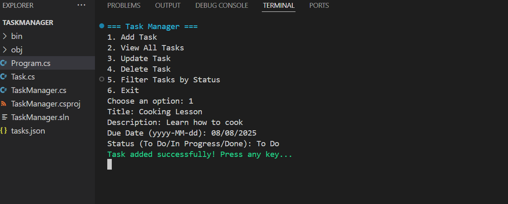
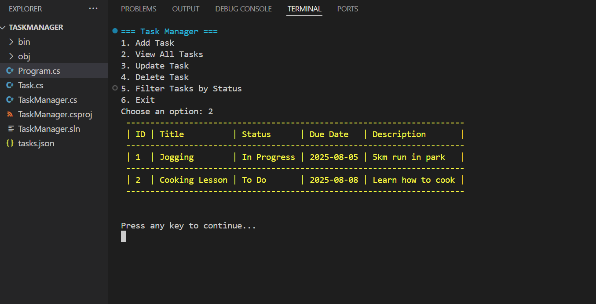
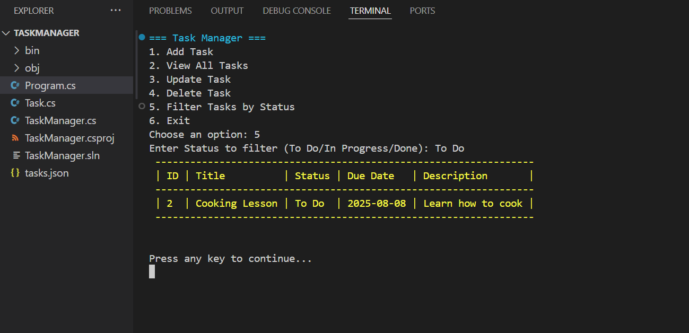
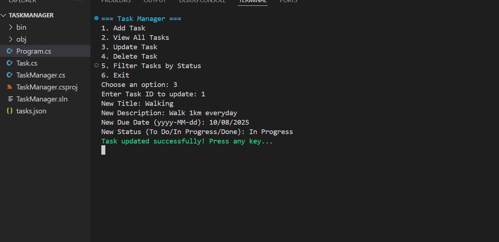
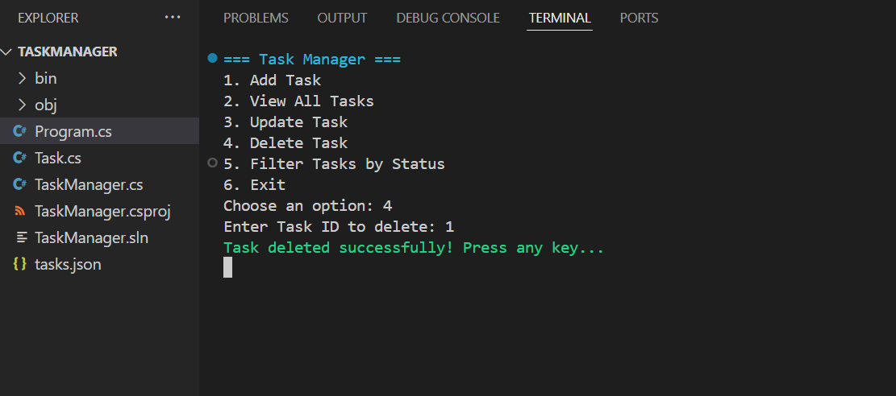

# Task Manager (C# Console App)

A C# console application for managing tasks, built with .NET 9. Users can add, view, update, delete, and filter tasks by status (To Do, In Progress, Done).

## Features
- Create tasks with a title, description, due date, and status (To Do, In Progress, Done).

- View all tasks or filter by status.

- Update or delete existing tasks.

- Persistent storage in `tasks.json`.
- Input validation for robust user experience.

## Prerequisites
- [.NET 9 SDK](https://dotnet.microsoft.com/download/dotnet/9.0)
- Visual Studio Code or any C# IDE

## How to run this project
1. Clone or download this repository
2. Open the folder in Visual Studio or Visual Studio Code
3. Build and run the project